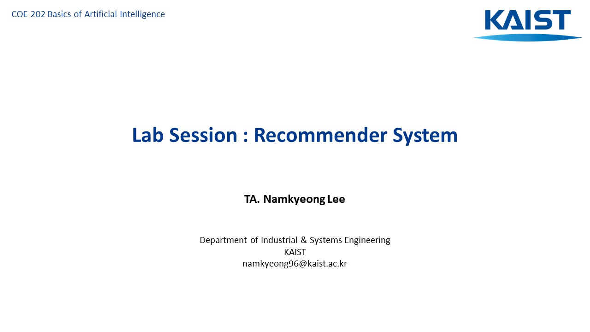
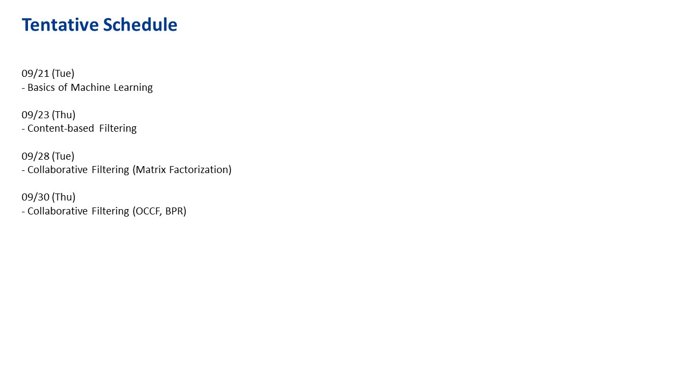
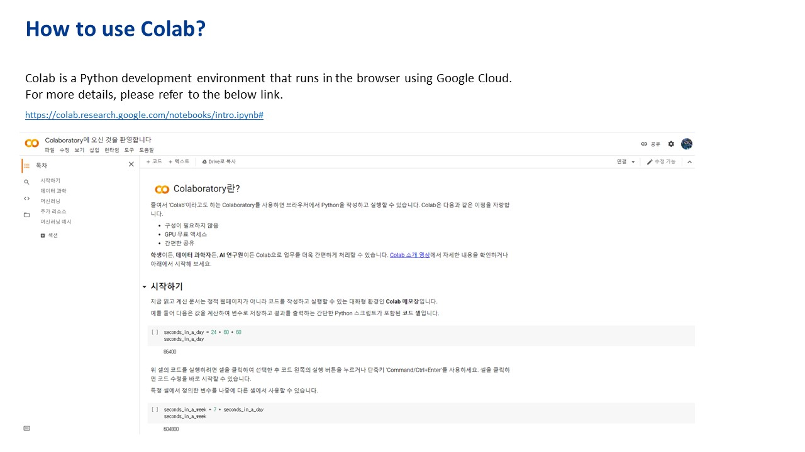
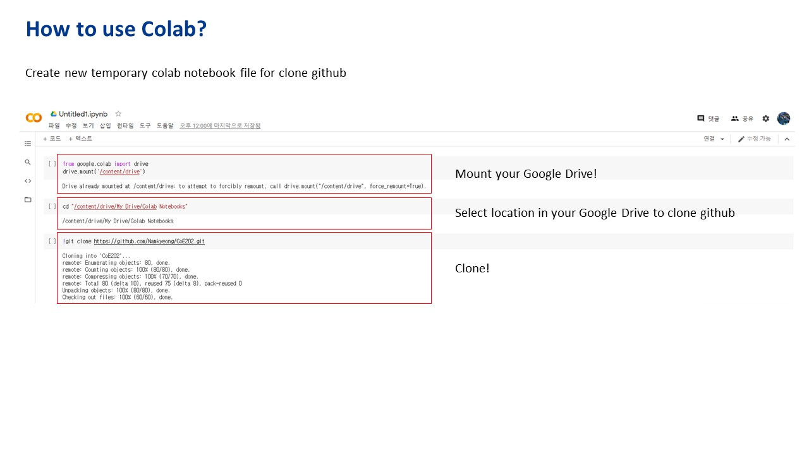
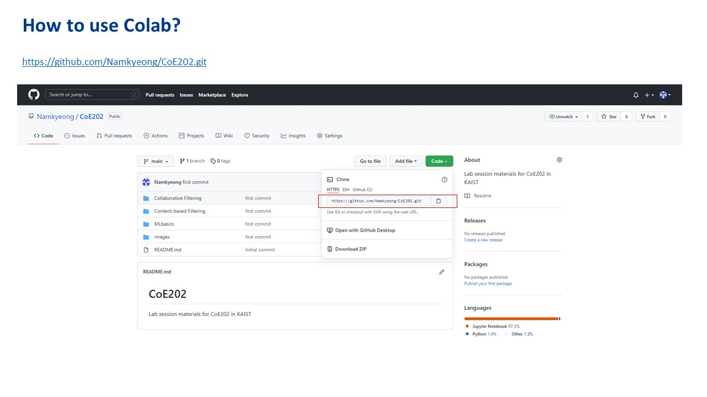
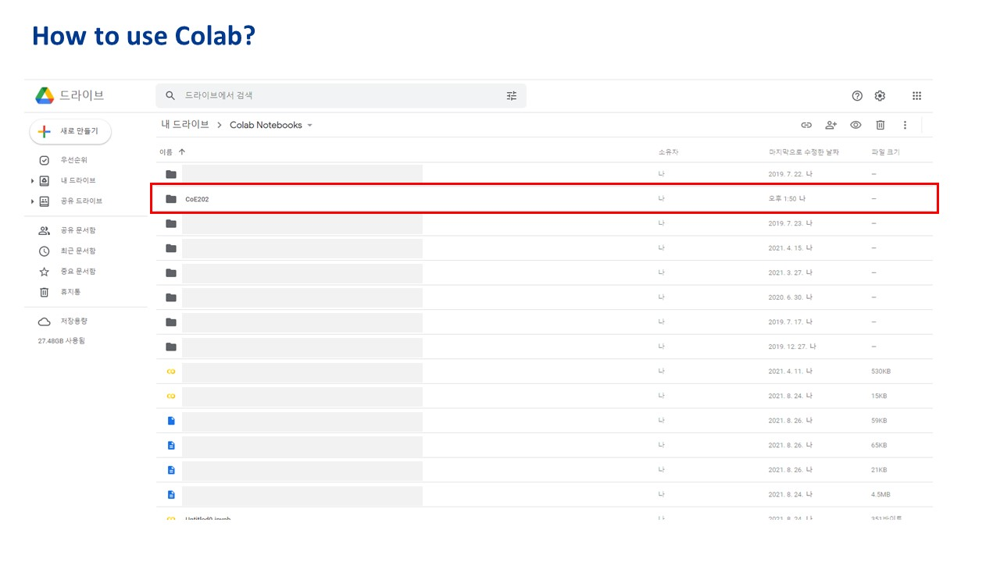
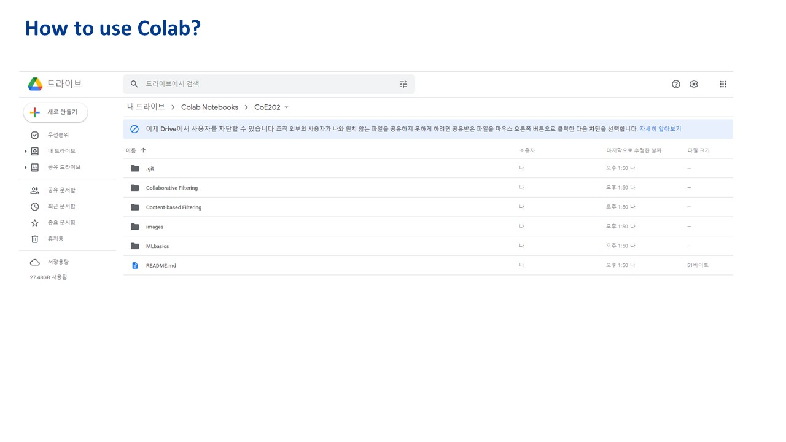

# CoE202
This repository contains lab session materials for **CoE202** in KAIST.

In this section of course, we aim to learn the basics of **Recommendation System**.

Why Recommendation?
- To identify things that **we might like**
- To help people **discover new content**
- To **discover which things go together**
- To **personalize user experiences** in response to user feedback

<kbd>
    </img>
</kbd>
<kbd>
    </img>
</kbd>
<kbd>
    </img>
</kbd>
<kbd>
    </img>
</kbd>
<kbd>
    </img>
</kbd>
<kbd>
    </img>
</kbd>
<kbd>
    </img>
</kbd>